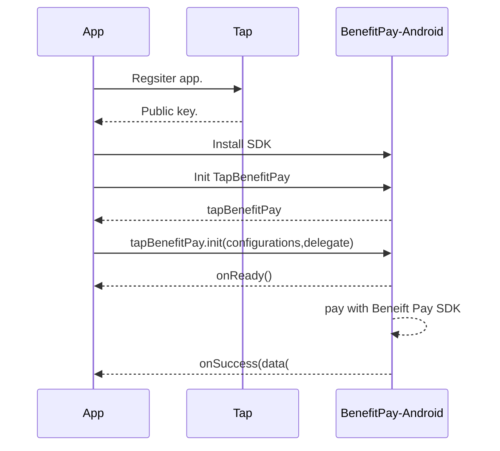

# BenefitPay-Android
We at [Tap Payments](https://www.tap.company/) strive to make your payments easier than ever. We as a PCI compliant company, provide you a from the self solution to process Payment Button Solution in your Android app.

[](https://tap-payments.github.io/goSellSDK-Android/)
[](https://tap-payments.github.io/goSellSDK-Android/)
[](https://stuff.mit.edu/afs/sipb/project/android/docs/reference/packages.html)
[](https://stuff.mit.edu/afs/sipb/project/android/docs/reference/packages.html)
[](https://stuff.mit.edu/afs/sipb/project/android/docs/reference/packages.html)


# Demo


# Requirements

 1. We support from Android minSdk 24
 2. Kotlin support version 1.8.0

# Steps overview


# Get your Tap keys
You can always use the example keys within our example app, but we do recommend you to head to our [onboarding](https://register.tap.company/sell)  page. You will need to register your `package name` to get your `Tap Key` that you will need to activate our `BenefitPay-Android`.

# Installation

We got you covered, `BenefitPay-Android` can be installed with all possible technologies.

## Gradle

in project module gradle 

```kotlin
allprojects {
    repositories {
        google()
        jcenter()
        maven { url 'https://jitpack.io' }
    }
}
```

Then get latest dependency  in your app module gradle
```kotlin
dependencies {
  implementation : 'com.github.Tap-Payments:BenefitPay-Android:{latest-tag-release}'
}
```

# Simple Integration
You can initialize `BenefitPay-Android` in different ways

 1. XML.
 2. Code.
## XML

```kotlin
<LinearLayout xmlns:android="http://schemas.android.com/apk/res/android"
    xmlns:app="http://schemas.android.com/apk/res-auto"
    xmlns:tools="http://schemas.android.com/tools"
    android:layout_width="match_parent"
    android:orientation="vertical"
    android:layout_height="match_parent"
    tools:context=".main_activity.MainActivity">

 <company.tap.tapcardformkit.open.web_wrapper.TapBenefitPay
        android:id="@+id/tapBenefitPay"
        app:layout_constraintStart_toStartOf="parent"
        app:layout_constraintTop_toTopOf="parent"
        app:layout_constraintEnd_toEndOf="parent"
        android:layout_width="match_parent"
        android:layout_height="wrap_content"
        />

</LinearLayout>
 
- in your activity class : 

  BeneiftPayConfiguration.configureWithTapBenfitPayDictionaryConfiguration(
            this,
            findViewById<TapBenefitPay>(R.id.tapBenefitPay),
            configuration,
            TapBenefitPayStatusDelegate: this) 
```

## Code

 ```kotlin

       lateinit var tapBenefitPay: TapBenefitPay

       override fun onCreate(savedInstanceState: Bundle?){
        super.onCreate(savedInstanceState)
        setContentView(R.layout.activity_main)

        /**
         * operator
         */
        val operator = HashMap<String,Any>()
        operator.put("publicKey","")
        operator.put("hashString","")

        /**
         * order
         */
        val order = HashMap<String,Any>()
        order.put("id",ordrId ?: "")
        order.put("amount", amount?.toInt() ?: 1)
        order.put("currency","BHD")
        order.put("description","")
        order.put("reference","")

        /**
         * customer
         */
        val customer = java.util.HashMap<String,Any>()
        customer.put("nameOnCard", "test")
        customer.put("editable",cardHolder)
        customer.put("contact",contact)
        customer.put("name", listOf(name))

        /**
         * configuration 
         */
        val configuration = LinkedHashMap<String,Any>()

        configuration.put("operator",operator)
        configuration.put("order",order)
        configuration.put("customer",customer)

        val linearLayoutParams = LinearLayout.LayoutParams(
            LinearLayout.LayoutParams.WRAP_CONTENT, LinearLayout.LayoutParams.WRAP_CONTENT
        )
        /** create dynamic view of TapCardKit view **/ 
        tapBenefitPay  = TapBenefitPay(this)
        tapBenefitPay.layoutParams = linearLayoutParams
        /** refrence to parent layout view **/  
        this.findViewById<LinearLayout>(R.id.linear_layout).addView(tapBenefitPay)


     BeneiftPayConfiguration.configureWithTapBenfitPayDictionaryConfiguration(
            this,
            findViewById<TapBenefitPay>(R.id.tapBenefitPay),
            configuration,
            TapBenefitPayStatusDelegate: this) 

}
        
```
## Simple TapCardStatusDelegate
A protocol that allows integrators to get notified from events fired from the `BenefitPay-Android`. 

```kotlin
    interface TapBenefitPayStatusDelegate {
    
     ///   Will be fired whenever the card sdk finishes successfully the task assigned to it. Whether `TapToken` or `AuthenticatedToken`
    override fun  onSuccess(data: String) {
     }
    /// Will be fired whenever there is an error related to the card connectivity or apis
    /// - Parameter data: includes a JSON format for the error description and error
    override fun onError(data: String){
    }
}
```

# Advanced Integration

## Advanced Documentation

### Main input documentation
To make our sdk as dynamic as possible, we accept the input in a form of a `HashMap dictionary` . We will provide you with a sample full one for reference.
It is always recommended, that you generate this `HashMap dictionary` from your server side, so in future if needed you may be able to change the format if we did an update.


|Configuration|Description | Required | Type| Sample
|--|--|--| --|--|
| operator| This is the `Key` that you will get after registering you package name. | True  | String| `var operator=HashMap<String,Any>(),operator.put("publicKey","pk_test_YhUjg9PNT8oDlKJ1aE2fMRz7"),operator.put("hashString","")` |
| order| This is the `order id` that you created before or `amount` , `currency` , `transaction` to generate a new order .   It will be linked this token. | True  | `Dictionary`| ` var order = HashMap<String, Any>(), order.put("id","") order.put("amount",1),order.put("currency","BHD"),order.put("description",""), order.put("reference":"A reference to this order in your system"))` |
| invoice| This is the `invoice id` that you want to link this token to if any. | False  | `Dictionary`| ` var invoice = HashMap<String,Any>.put("id","")` |
| merchant| This is the `Merchant id` that you will get after registering you bundle id. | True  | `Dictionary`| ` var merchant = HashMap<String,Any>.put("id","")` |
| customer| The customer details you want to attach to this tokenization process. | True  | `Dictionary`| ` var customer =  HashMap<String,Any> ,customer.put("id,""), customer.put("nameOnCard","Tap Payments"),customer.put("editable",true),) var name :HashMap<String,Any> = [["lang":"en","first":"TAP","middle":"","last":"PAYMENTS"]] "contact":["email":"tap@tap.company", "phone":["countryCode":"+965","number":"88888888"]]] customer.put("name",name) , customer.put("contact",contact)` |
| interface| Needed to defines look and feel related configurations. | False  | `Dictionary`| ` var interface = HashMap<String,Any> ,interface.put("locale","en"), interface.put("theme","light"), interface.put("edges","curved"),interface.put("colorStyle","colored"),interface.put("loader",true) // Allowed values for theme : light/dark. locale: en/ar, edges: curved/flat, direction:ltr/dynaimc,colorStyle:colored/monochrome` |
| post| This is the `webhook` for your server, if you want us to update you server to server. | False  | `Dictionary`| ` var post = HashMap<String,Any>.put("url","")` |


### Documentation per variable

 - operator:
	 - Responsible for passing the data that defines you as a merchant within Tap system.
 - operator.publicKey:
	 - A string, which you get after registering the app bundle id within the Tap system. It is required to correctly identify you as a merchant.
	 - You will receive a sandbox and a production key. Use, the one that matches your environment at the moment of usage.
 - order:
	 - The details about the order that you will be using the token you are generating within.
 - order.id:
	 - The id of the `order` if you already created it using our apis.
 - order.currency:
	 - The intended currency you will perform the order linked to this token afterwards.
 -  order.amount:
	 - The intended amount you will perform the order linked to this token afterwards.
 - order.description:
	 - Optional string to put some clarifications about the order if needed.
 - order.reference:
	 - Pass this value if you want to link this order to the a one you have within your system.

 - invoice.id:
	 - Optional string to pass an invoice id, that you want to link to this token afterwards.
 - merchant.id:
	 - Optional string to pass to define a sub entity registered under your key in Tap. It is the `Merchant id` that you get from our onboarding team.
 - customer.id:
	 - If you have previously have created a customer using our apis and you want to link this token to him. please pass his id.
 - customer.name:
	 - It is a list of localized names. each name will have:
		 - lang : the 2 iso code for the locale of this name for example `en`
		 - first : The first name.
		 - middle: The middle name.
		 - last : The last name.
 - customer.nameOnCard:
	 - If you want to prefill the card holder's name field.
 - customer.editable:
	 - A boolean that controls whether the customer can edit the card holder's name field or not.
 - customer.contact.email:
	 - An email string for  the customer we are creating. At least the email or the phone is required.
 - customer.contact.phone:
	 - The customer's phone:
		 - countryCode
		 - number
- interface.loader:
	- A boolean to indicate wether or not you want to show a loading view on top of the card form while it is performing api requests.
- interface.locale:
	- The language of the card form. Accepted values as of now are:
		- en
		- ar
- interface.theme:
	- The display style of the card form. Accepted values as of now are:
		- light
		- dark
		- dynamic // follow the device's display style
- interface.edges:
	- How do you want the edges of the card form to. Accepted values as of now are:
		- curved
		- flat
- interface.colorStyle:
	- How do you want the icons rendered inside the card form to. Accepted values as of now are:
		- colored
		- monochrome

## Initialization of the input

You can create a Dictionary HashMap to pass the data to our sdk. The good part about this, is that you can generate the data from one of your apis. Whenever we have an update to the configurations, you can update your api. This will make sure, that you will not have to update your app on the Google Play Store.

```kotlin
     /**
       * operator
       */
      val operator = HashMap<String,Any>()
        operator.put("publicKey","pk_test_YhUjg9PNT8oDlKJ1aE2fMRz7")
        operator.put("hashString","")

        /**
         * merchant
         */
        val merchant = HashMap<String,Any>()
        merchant.put("id","")

        /**
         * invoice
         */
        val invoice = HashMap<String,Any>()
        invoice.put("id","")
        /**
         * post
         */
        val post = HashMap<String,Any>()
        post.put("url","")


        /**
         * phone
         */
        val phone = HashMap<String,Any>()
        phone.put("countryCode","+20")
        phone.put("number","011")

        /**
         * contact
         */
        val contact = HashMap<String,Any>()
        contact.put("email","test@gmail.com")
        contact.put("phone",phone)
        /**
         * name
         */
        val name = HashMap<String,Any>()
        name.put("lang","en")
        name.put("first","Tap")
        name.put("middle","")
        name.put("last","Payment")

        /**
         * customer
         */
        val customer = HashMap<String,Any>()
        customer.put("nameOnCard","")
        customer.put("editable",true)
        customer.put("contact",contact)
        customer.put("name", listOf(name))

        /**
         * order
         */
        val order = HashMap<String,Any>()
        order.put("id","order_id")
        order.put("amount","1")
        order.put("currency","BHD")
        order.put("description","description")
        order.put("reference","refrence_id")

        /**
         * interface
         */
        val tapInterface = HashMap<String,Any>()
        tapInterface.put("locale","en")
        tapInterface.put("theme","light")
        tapInterface.put("edges","curved")
        tapInterface.put("colorStyle","colored")
        tapInterface.put("loader",true)

        /**
         * configuration request
         */

        val configuration = LinkedHashMap<String,Any>()
        configuration.put("operator", operator)
        configuration.put("merchant",merchant)
        configuration.put("order",order)
        configuration.put("customer",customer)
        configuration.put("invoice",invoice)
        configuration.put("post",post)
        configuration.put("interface",tapInterface) 

```


## Advanced TapCardStatusDelegate
An interface that allows integrators to get notified from events fired from the `TapBenefitPay`. 
```kotlin

interface TapBenefitPayStatusDelegate {


    override fun onSuccess(data: String)
/**
        Will be fired whenever the TapBenefitPay sdk finishes successfully the task assigned to it.
     - Parameter data: will include the data in JSON format. For `TapToken`:
     {
         "id": "tok_MrL97231045SOom8cF8G939",
         "created": 1694169907939,
         "object": "token",
         "live_mode": false,
         "type": "CARD",
         "source": "CARD-ENCRYPTED",
         "used": false,
         "card": {
             "id": "card_d9Vj7231045akVT80B8n944",
             "object": "card",
             "address": {},
             "funding": "CREDIT",
             "fingerprint": "gRkNTnMrJPtVYkFDVU485Gc%2FQtEo%2BsV44sfBLiSPM1w%3D",
             "brand": "VISA",
             "scheme": "VISA",
             "category": "",
             "exp_month": 4,
             "exp_year": 24,
             "last_four": "4242",
             "first_six": "424242",
             "name": "AHMED",
             "issuer": {
                "bank": "",
                "country": "GB",
                "id": "bnk_TS07A0720231345Qx1e0809820"
            }
         },
         "url": ""
     }
     */

    override fun onReady()
    /**
     *  Will be fired whenever the TapBenefitPay is rendered and loaded
     */

  override fun onClick()
    /**
     *  Will be fired whenever the TapBenefitPay button is clicked
     */


  override fun onOrderCreated()
    /**
     *  Will be fired whenever order is successfully created
     */


  override fun onChargeCreated()
    /**
     *  Will be fired whenever charging occurs
     */

 override fun onCancel()
    /**
     *  Will be fired whenever cancelling charging 
     */


    override fun onError(error: String)=
   /**
     *  Will be fired whenever there is an error related to the card connectivity or apis
     *  Parameter data: includes a JSON format for the error description and error
     */


}


```
